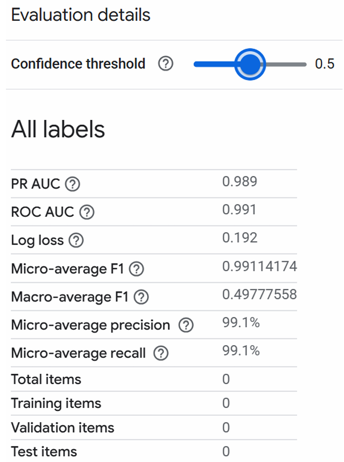
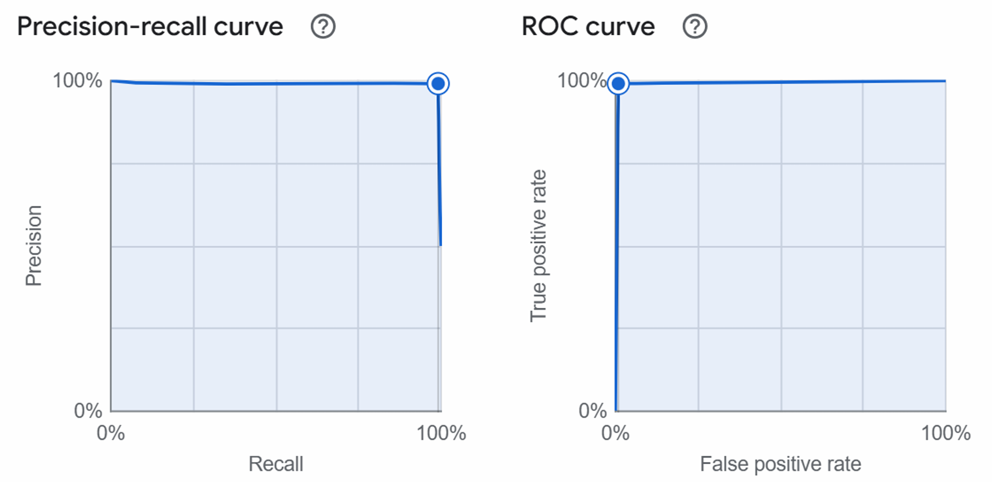
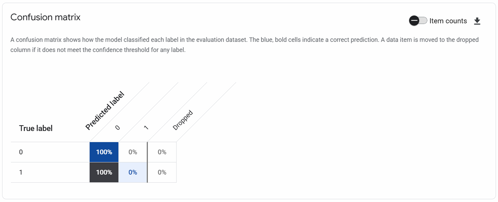
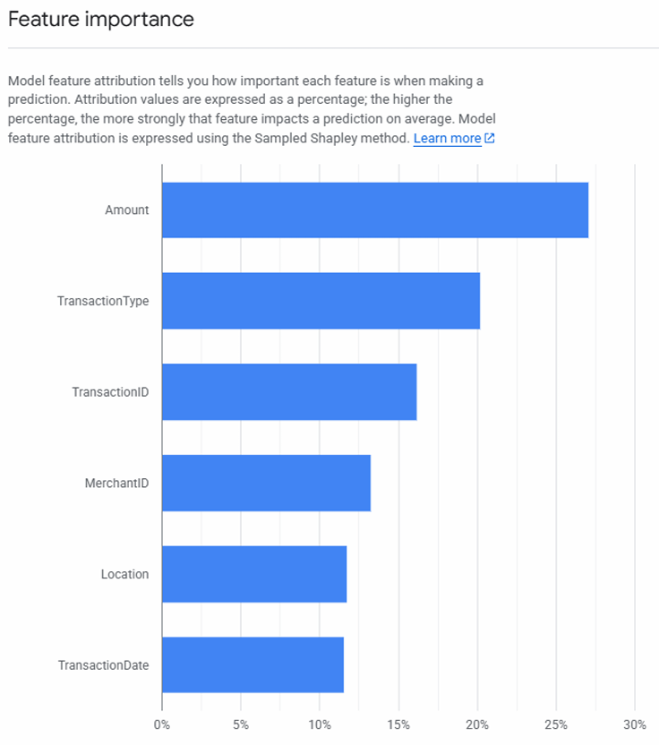

# Project Walkthrough

## 1. Project Overview

This project was my Module 4 assignment for **EAI6020: AI Systems Technology**.

I used **Google Cloud Vertex AI AutoML** to build and evaluate a credit card fraud detection model. The goal was to study how a cloud AI tool can support a real business problem, especially when the data is highly imbalanced.

This public repo version is a cleaner portfolio version. It focuses on the problem, the workflow, the evaluation logic, and the final threshold decision.

Related files:

- [Portfolio PDF](../portfolio/EAI6020_VertexAI_Credit_Card_Fraud_Portfolio_Cheng_Liu.pdf)
- [Original Assignment Report](../reports/EAI6020_Module_4_Assignment_Cheng_Liu.pdf)
- [Dataset Note](../data/README.md)

---

## 2. Business Problem

Credit card fraud detection is a high-risk classification problem.

The key challenge is that fraudulent cases are rare, but missing them is expensive. At the same time, flagging too many valid transactions can hurt customer trust.

To make the project more practical, I used a simple business scenario:

- False Negative cost = $500
- False Positive cost = $50

This made threshold selection part of the project, not just model training.

---

## 3. Dataset

The original source was a public Kaggle dataset about credit card fraud detection.

For my Vertex AI workflow, I ultimately used a **20,000-row sample** that preserved the **1% fraud ratio** from the larger source.

Main fields included:

- `TransactionID`
- `TransactionDate`
- `Amount`
- `MerchantID`
- `TransactionType`
- `Location`
- `IsFraud`

See the full dataset note here:

- [data/README.md](../data/README.md)

---

## 4. Why Precision-Recall mattered

This was an imbalanced classification problem, so simple accuracy was not enough.

A model can appear strong overall while still performing poorly on the minority fraud class. That is why I focused on:

- Precision-Recall curve
- ROC curve
- confusion matrix
- threshold behavior

This was also one of the main ideas I learned from the course: use a method that fits the business problem, not just the easiest metric to report.

---

## 5. Workflow

My project flow looked like this:

1. Select a public fraud detection dataset
2. Define a simple business cost scenario
3. Upload and prepare data in Vertex AI
4. Train an AutoML tabular classification model
5. Review PR AUC, ROC AUC, F1, confusion matrix, and feature importance
6. Compare threshold trade-offs
7. Choose a better business threshold
8. Summarize lessons learned

This project is more about **practical workflow and evaluation thinking** than writing custom model code from scratch.

---

## 6. Challenge during training

My first training attempt used the full dataset, but it failed because of a **QUOTA_FOR_INSTANCES** error.

To solve this, I created a smaller **20,000-row stratified sample** while keeping the original fraud ratio. This helped me complete the training and also taught me that AI projects involve cloud resource planning, not only model logic.

That part was useful for me because it made the project feel more real. The model work was not isolated from system limits.

---

## 7. Model setup

My successful training setup used:

- **Target column:** `IsFraud`
- **Optimization objective:** `AUC PR`
- **Budget:** `1 node hour`

This setup was chosen because the main goal was to improve model usefulness for rare fraud cases.

---

## 8. Evaluation details

The main reported results were:

- **PR AUC = 0.989**
- **ROC AUC = 0.991**
- **Macro-average F1 at threshold 0.5 = about 0.498**

This taught me an important lesson: good overall ranking metrics do not automatically mean the default decision threshold is good enough for the actual business use case.

### Evaluation screenshot

From this screen, I could see that the default threshold was set to **0.5** and the model looked strong at a high level. But that was not enough to decide whether the model behavior was actually good for fraud detection.

---

## 9. PR curve and ROC curve

I used the PR curve and ROC curve to understand model quality from a better angle.

For this kind of imbalanced problem, the PR curve mattered more because it focused more directly on the trade-off between precision and recall for the fraud class.

### PR / ROC screenshot

This part helped me connect what I learned in class to an actual tool workflow. It was not just theory anymore.

---

## 10. Confusion matrix

The confusion matrix gave me another way to check how the model was behaving at the current threshold.

### Confusion matrix screenshot

This was useful because a model can still look good on summary metrics while being weak on the cases that matter most.

That is why I did not want to stop at PR AUC and ROC AUC only.

---

## 11. Threshold decision

The default threshold of **0.5** was not suitable.

I compared different threshold behaviors and selected **0.75** as a better balance point.

At this threshold, the model achieved approximately:

- **Precision = 96%**
- **Recall = 82%**

I chose this threshold because it gave a better balance between:

- catching fraud
- avoiding too many false alarms
- protecting customer experience

This was one of the most important parts of the project for me. It showed that model use is also a decision problem.

---

## 12. Feature importance

The feature importance view showed that the strongest model signals included:

- Amount
- TransactionType
- TransactionID
- MerchantID
- Location
- TransactionDate

### Feature importance screenshot

This part helped me learn how explainability can support trust in AI systems. Even in a simple course project, it was useful to see which fields the model relied on most.

---

## 13. Final takeaway

This project is not my best example of model coding, but it is one of my better examples of **AI systems thinking**.

It shows that I can:

- connect model evaluation with business trade-offs
- use cloud AI tools practically
- think carefully about rare-event classification
- explain results in a way that non-technical stakeholders can understand

For me, the value of this project is in the practice:

- learning how Vertex AI AutoML works
- applying course ideas in a real workflow
- seeing how evaluation choices affect business decisions
- understanding that implementation details also matter

## Related project files

- [Portfolio PDF](../portfolio/EAI6020_VertexAI_Credit_Card_Fraud_Portfolio_Cheng_Liu.pdf)
- [Original Assignment Report](../reports/EAI6020_Module_4_Assignment_Cheng_Liu.pdf)
- [Course Context](course-context.md)
- [Dataset Note](../data/README.md)